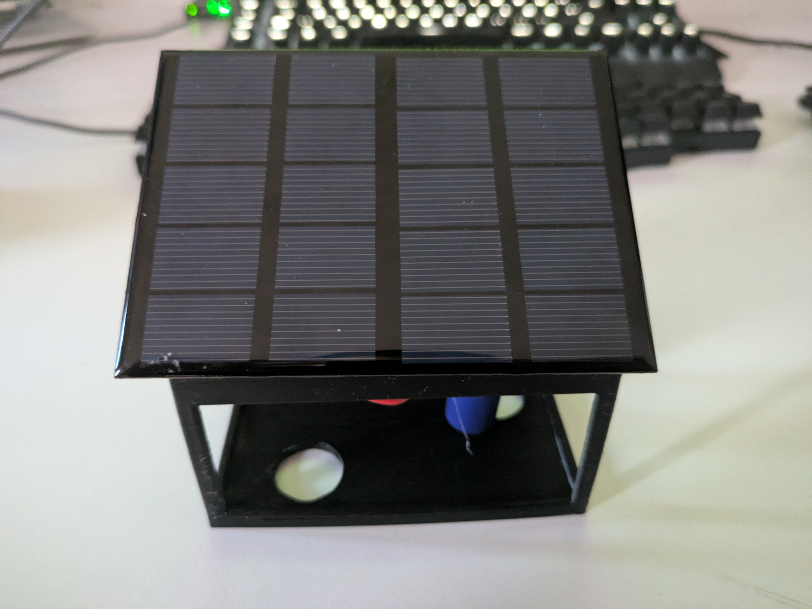
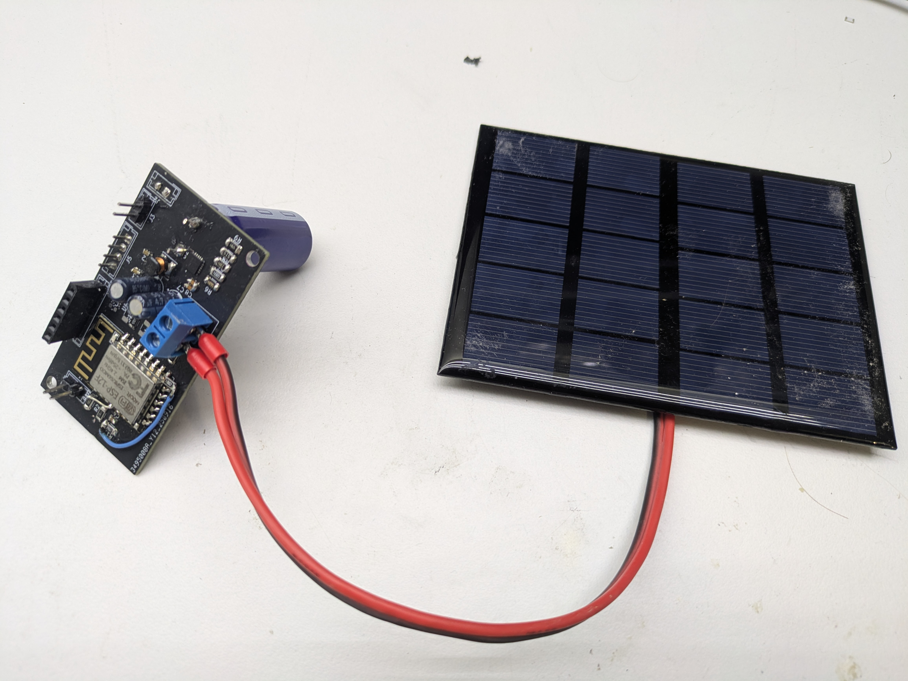

# Solar Powered Temperatur Sensor with Super Capacitor

This is a small fun project: a temperature sensor running only on solar energy, without a battery.
It contains code for the ESP8266 to connect to an MQTT server, publish its temperature, and then go into deep sleep for 10 seconds.
The Python script captures the readings and stores them in a database.
For charging, it uses a BQ25505 MPPT charger.

